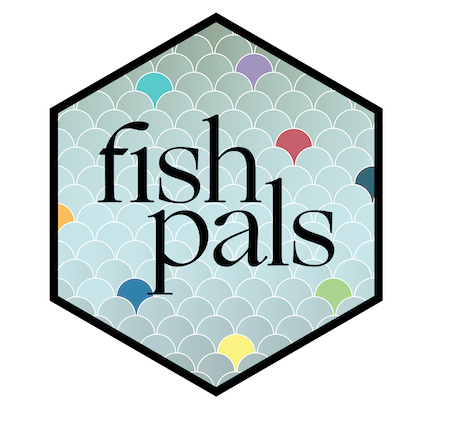

<!-- README.md is generated from README.Rmd. Please edit that file -->

```{r, echo = FALSE}
knitr::opts_chunk$set(
  collapse = TRUE,
  comment = "#>",
  fig.path = "man/figures/README-",
  echo = TRUE,
  eval = TRUE
)
library(fishpals)
library(ggplot2)
```

# fishpals 
Fish color palettes, themes, and scales (ha!) for ggplot2 plots.

## Usage

```{r echo=TRUE, eval=FALSE}

    devtools::install_github('fishciences/fishpals')
    library(fishpals)
    library(ggplot2)

    
    ggplot(iris, aes(Sepal.Width, Sepal.Length)) +
       geom_point(size = 2.5, aes(color = Species), show.legend = FALSE) +
       scale_color_fishpals("greensunfish") +
       theme_pres()
    
```


       
See `?fishpals::theme_report` for all available themes and `?fishpals::scale_color_fishpals` for available `ggplot2` scales. 

The `fishpals` palettes default to diverging colors when the number of required colors is small (n <= 5).

```{r}
ggplot(iris) +
  geom_bar(aes(x = Species, y = Sepal.Width, fill = Species), stat = "identity") +
  theme_pub() +
  scale_fill_fishpals("adultchinook")

```


### Examples

Faceted scatterplot with the presentation theme (`theme_pres()`) and `surgewrasse` palette, discrete vs. continuous:

```{r}
# discrete color scale
ggplot(mtcars) +
   geom_point(aes(x = disp, 
                  y = hp, 
                  color = factor(carb) ),
              size = 3.5, alpha = 0.75) +
  facet_wrap(~am) +
  scale_color_fishpals("surgewrasse", discrete = TRUE) +
  theme_pres()

```


For publications, we've set some defaults that journals tend to like:

```{r}
# sample code  modified from: http://r-statistics.co/Top50-Ggplot2-Visualizations-MasterList-R-Code.html
data("midwest", package = "ggplot2")

ggplot(midwest, aes(x=area, y=poptotal)) +
  geom_point(aes(col=state, size=popdensity), alpha = 0.75) +
  xlim(c(0, 0.1)) +
  ylim(c(0, 500000)) +
  labs(subtitle="Area Vs Population",
       y="Population",
       x="Area",
       caption = "Source: midwest") +
  scale_color_fishpals("adultchinook") +
  theme_pub() +
  theme(legend.position = "none")

```

The juvenile steelhead palette  with `theme_report()`:

```{r}

ggplot(mpg, aes(class, hwy)) + 
  geom_boxplot(aes(color = class), outlier.shape = NA, show.legend = FALSE) +
  geom_jitter(width = 0.2, alpha = 0.5, aes(color = class), 
              show.legend = FALSE) +
  scale_color_fishpals("juvsteelhead") +
  theme_report()

```


Because this package was initially developed for CFS employees, we also have some built-in "branded" color palettes, `genidaqs` and `CFS` (which is the default palette for the `scale` functions in `fishpals`):

```{r}
# Histogram on a Continuous (Numeric) Variable
# code source: http://r-statistics.co/Top50-Ggplot2-Visualizations-MasterList-R-Code.html
g <- ggplot(mpg, aes(displ)) + 
  scale_fill_fishpals(palette = "genidaqs")

g + geom_histogram(aes(fill=class), 
                   binwidth = .1, 
                   col="black", 
                   size= 0.1) +
  theme_report()


g + geom_histogram(aes(fill=class), 
                   bins=5, 
                   col="black", 
                   size=.1) +   
  scale_fill_fishpals(reverse = TRUE) +
  theme_pres()

```

