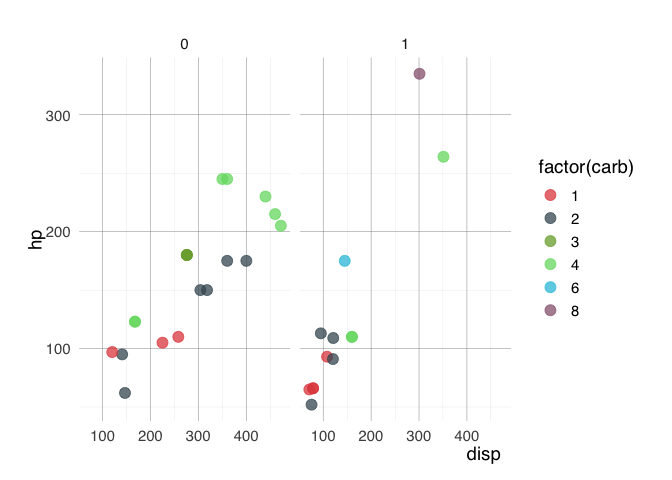
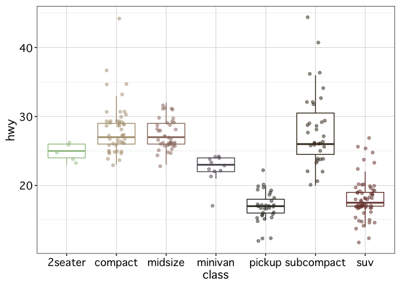
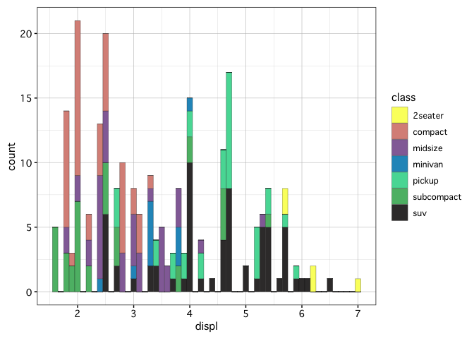

<!-- README.md is generated from README.Rmd. Please edit that file -->

The `fishpals` package provides fish-inspired color palettes and some
lightweight `ggplot` themes that we hope will be especially useful to
scientists when preparing reports, presentations, and publications.

# Installing and loading `fishpals` into R

<br>

`fishpals` is trivial, so it’s unlikely to ever be submitted to CRAN.
You can install it using either `devtools::install_github()` or the
`install_github` function from the `remotes` package:

``` r
devtools::install_github("fishsciences/fishpals", build_vignettes = TRUE) 
library(fishpals)
```

# Convenience functions

To see all the palettes included in the `fishpals` package, use
`getpals()`:

``` r
getpals()
#> [1] "adultchinook"   "adultsteelhead" "cfs"            "genidaqs"      
#> [5] "greensunfish"   "juvsteelhead"   "surgewrasse"
```

To view a particular palette, call it by name with `viewpals()`

``` r
viewpals("surgewrasse")
```

<!-- -->

To see a full list of all the colors in each palette, use
`get_fishpals_cols()`:

``` r
get_fishpals_cols()
#>            juvsteel green            juvsteel taupe             juvsteel grey 
#>                 "#A3C595"                 "#BA8F78"                 "#5D5360" 
#>     juvsteel jungle green       juvsteel tuscan red     adultsteel dark liver 
#>                 "#1c240d"                 "#784039"                 "#504C41" 
#>      adultsteel red ochre           adultsteel gray       adultsteel feldgrau 
#>                 "#E2704D"                 "#B8BABD"                 "#4B5859" 
#> adultsteel spanish bistre               chinook red             chinook olive 
#>                 "#707239"                 "#BA1D57"                 "#8DAD6E" 
#>         chinook dark gray              chinook blue              chinook pink 
#>                 "#273535"                 "#0C4FA0"                 "#EFB0A1" 
#>             sunfish green               sunfish tan            sunfish yellow 
#>                 "#4EC4B8"                 "#8C7A4B"                 "#F1B24A" 
#>              sunfish gray         sunfish dark gray                  CFS blue 
#>                 "#636271"                 "#2D3040"                 "#1372AA" 
#>             CFS dark gray             CFS gridlines                   CFS tan 
#>                 "#3B4856"                 "#9FADBD"                 "#8B662E" 
#>             CFS light tan                  CFS teal           genidaqs yellow 
#>                 "#C3985E"                 "#1CD2A3"                 "#FAFF6B" 
#>             genidaqs blue            genidaqs brown            genidaqs green 
#>                 "#2597C4"                 "#3A3737"                 "#6CFC95" 
#>             genidaqs pink        surgewrasse orange          surgewrasse teal 
#>                 "#CA5B97"                 "#E24D4D"                 "#1C5B67" 
#>         surgewrasse green          surgewrasse blue        surgewrasse purple 
#>                 "#B6DD18"                 "#12DAF6"                 "#966480"
```

# The `scale_*_fishpals()` functions

`fishpals` is designed to integrate with `ggplot2` code, and so provides
two `ggplot2` scale functions for displaying its custom color palettes.
To use them, map a variable to a color aesthetic and call the
appropriate scale function: `scale_fill_fishpals()` or
`scale_color_fishpals()`:

``` r
ggplot(warpbreaks) +
   geom_boxplot(aes(x = wool, 
                    y = breaks, 
                    color = wool,
                    fill = wool),
                alpha = 0.5,
                width = 0.5,
                show.legend = FALSE) +
  facet_wrap(~tension,
             labeller = labeller(tension = 
                                   c("L" = "Low",
                                     "M" = "Medium",
                                     "H" = "High")
                              )) +
  scale_color_fishpals(discrete = TRUE) +
  scale_fill_fishpals(discrete = TRUE) +
  labs(x = "Wool type",
       y = "Number of breaks",
       title = "Breaks ~ wool type + tension level")
```

<!-- -->

The default color palette is “cfs”. To use a different one, just call it
by name:

``` r
ggplot(warpbreaks) +
   geom_boxplot(aes(x = wool, 
                    y = breaks, 
                    color = wool,
                    fill = wool),
                alpha = 0.5,
                width = 0.5,
                show.legend = FALSE) +
  facet_wrap(~tension,
             labeller = labeller(tension = 
                                   c("L" = "Low",
                                     "M" = "Medium",
                                     "H" = "High")
                              )) +
  scale_color_fishpals("adultchinook", discrete = TRUE) +
  scale_fill_fishpals("adultchinook", discrete = TRUE) +
  labs(x = "Wool type",
       y = "Number of breaks",
       title = "Breaks ~ wool type + tension level")
```

<!-- -->

# Lightweight Themes

## `theme_report()`

This theme is designed to have good properties when knitting to pdf or
to Microsoft Word. These properties include:

1.  Default size 11 font, with size 11 for axis titles and size 14 for
    chart titles.
2.  Default inner border around the plot margins and the inner panel
    (`inner_border = TRUE`).
3.  Close-ish spacing of facets to fit on a vertical page.
4.  Default legend position of bottom, horizontal orientation.

``` r
ggplot(mpg) +
  geom_point(aes(x = displ, y = hwy)) +
  theme_report() +
  labs(y = "Miles per gallon",
       x = "Engine displacement (L)",
       title = "Highway mpg ~ Engine displacement")
```

<!-- -->

``` r

ggplot(economics_long, aes(x = date, y = value01)) +
  geom_line(aes(color = variable),
             size = 0.5) +
  theme_report(inner_border = FALSE) +
  scale_color_fishpals() +
  guides(color = guide_legend(title = NULL)) +
  labs(x = "Date",
       y = "Value index",
       title = "Scaled economic indices ~ year") 
```

<!-- -->

``` r

ggplot(warpbreaks) +
   geom_boxplot(aes(x = wool, 
                    y = breaks, 
                    color = wool,
                    fill = wool),
                alpha = 0.5,
                width = 0.5,
                show.legend = FALSE) +
  facet_wrap(~tension,
             labeller = labeller(tension = 
                                   c("L" = "Low",
                                     "M" = "Medium",
                                     "H" = "High")
                              )) +
  scale_color_fishpals(discrete = TRUE) +
  scale_fill_fishpals(discrete = TRUE) +
  theme_report() +
  labs(x = "Wool type",
       y = "Number of breaks",
       title = "Breaks ~ wool type and tension level")
```

<!-- -->

## `theme_pres()`

This theme is designed with good defaults for presentations. These
include:

1.  Default size 14 font
2.  Default transparencies for plot.background element_rect()s, which
    will correspond to a dark theme when you save with ggsave(…, bg =
    “transparent”).
3.  Minimalist design for clean slides.
4.  Widely-spaced facet panels

``` r
ggplot(mpg) +
  geom_point(aes(x = displ, y = hwy)) +
  theme_pres() +
  labs(y = "Miles per gallon",
       x = "Engine displacement (L)",
       title = "Highway mpg ~ Engine displacement")
```

<!-- -->

``` r

ggplot(economics_long, aes(x = date, y = value01)) +
  geom_line(aes(color = variable),
             size = 0.5) +
  theme_pres() +
  scale_color_fishpals() +
  guides(color = guide_legend(title = NULL)) +
  labs(x = "Date",
       y = "Value index",
       title = "Scaled economic indices ~ year") 
```

<!-- -->

``` r


ggplot(warpbreaks) +
   geom_boxplot(aes(x = wool, 
                    y = breaks, 
                    color = wool,
                    fill = wool),
                alpha = 0.5,
                width = 0.25,
                show.legend = FALSE) +
  facet_wrap(~tension,
             labeller = labeller(tension = 
                                   c("L" = "Low",
                                     "M" = "Medium",
                                     "H" = "High")
                              ),
             nrow = 1) +
  scale_color_fishpals(discrete = TRUE) +
  scale_fill_fishpals(discrete = TRUE) +
  theme_pres() +
  labs(x = "Wool type",
       y = "Number of breaks",
       title = "Breaks ~ wool type + tension level")
```

<!-- -->

## `theme_pub()`

This theme has default font sizes and axis options that are often used
in publications.

``` r
ggplot(economics_long, aes(x = date, y = value01)) +
  geom_line(aes(color = variable),
             size = 0.5) +
  theme_pub() +
  scale_color_brewer(palette = 6) + # using color brewer black and white palette for demonstration
  guides(color = guide_legend(title = NULL)) +
  labs(x = "Date",
       y = "Value index",
       title = "Scaled economic indices ~ year") 
```

<!-- -->
